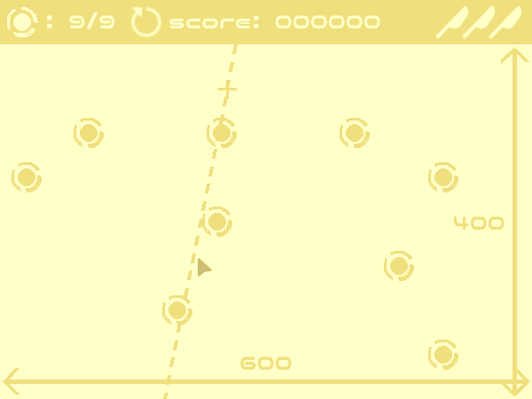
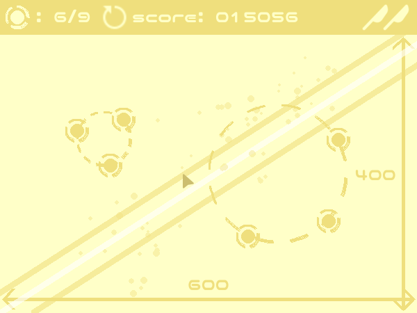

# RESIZE

ウィンドウをリサイズしながら球(?)を切り、高得点をゲットしよう！

このゲームはkiichigojam2026参加作品です。
(お題: 「きゅう」「きる」)

## 概要

4つのフェーズそれぞれで、9個の球が画面上に配置されます。
3回までのカットで出来るだけ多くの球を切りましょう！

ウィンドウを拡大することで球の間隔は大きくなり難しくなりますが、その分得点もアップ！

連続破壊ボーナスや完全破壊ボーナスもあるので、
戦略を組んで挑戦しましょう！

## 遊び方
- マウスの左ボタンを押す: ナイフの軌道の始点を設定
- 左ボタンを押したままドラッグ: ナイフの軌道プレビュー（カーソルが始点に近い時は表示されない）
- 左ボタンを離す: ナイフを放つ（プレビューが表示されない時はキャンセル）

## スクリーンショット

## スコア計算式

（すべて小数点切り捨て）

- 球破壊時のスコア加算: $(一度に破壊した数)^{1.2} \times ((縦のサイズ) + (横のサイズ)) \times \sqrt{(フェーズ番号)}$
- フェーズ終了時のボーナススコア: $10000 \times \sqrt{(フェーズ番号)} \times (全ての球破壊で1、さらにナイフの残り数ごとに+1)$

## 起動方法

Releaseから最新のバージョンをダウンロードして、main.exe/main.appを実行

## ライセンス
- コード: MIT License
- 画像素材: Icons8 ( https://icons8.jp ) の利用規約に従う
